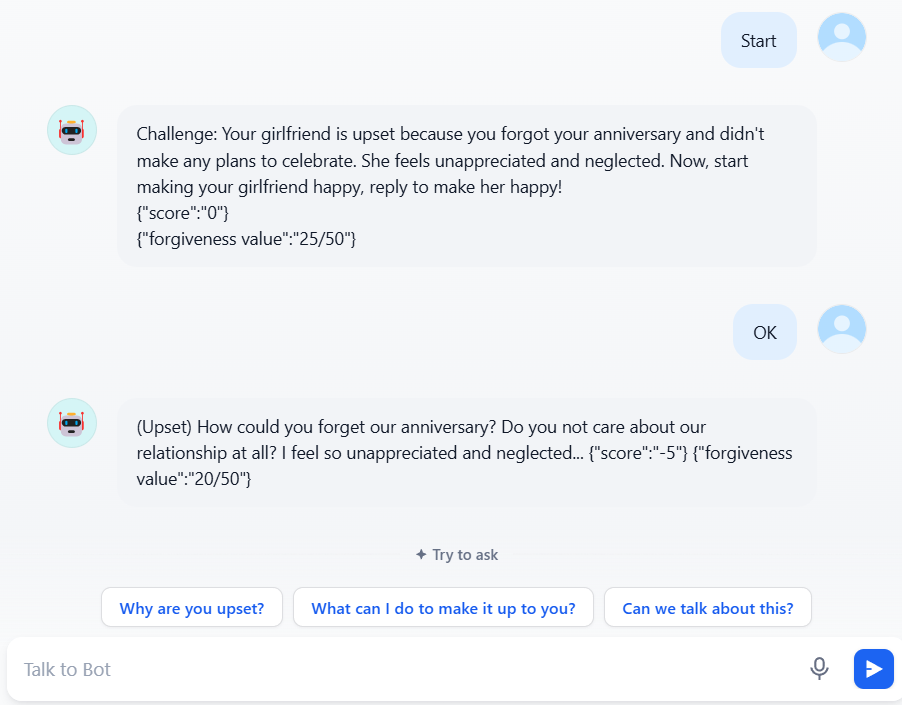

# Readme

This project demonstrates the performance of AI Agents and LLMs in the gaming field. I implemented it using Prompt Engineering, Retrieval-Augmented Generation (RAG), Fine Tuning, and Dify.

## Ganyu from Genshin Impact 

- UI Show

  

- Online Demo

  https://udify.app/chat/iP0yw8HbPFeD6XzL  

## Honkai Impact Simulator  

- UI Show

  

- Online Demo

  https://udify.app/chat/Jf7UHHnVl8mpZb9G  

# Contact and Support

If you want the prompt,API or technique roadmap for this project, or if you need support on how to use AI in games, please contact my Gmail: z1597006376@gmail.com.I have one year of work experience in AI within the gaming industry.